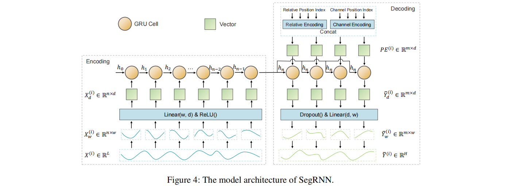
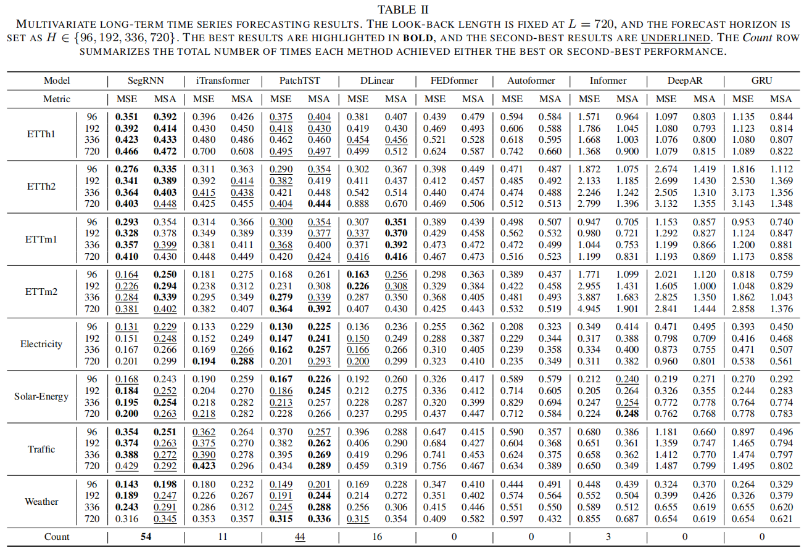

# SegRNN
Welcome to the official repository of the SegRNN paper: "[Segment Recurrent Neural Network for Long-Term Time Series Forecasting.](https://arxiv.org/abs/2308.11200)"

## Updates
🚩 **News** (2024.10): SegRNN will soon be included in [[PyPOTS]](https://github.com/WenjieDu/PyPOTS), a widely acclaimed and popular repository dedicated to multivariate partially-observed time series with missing values.

🚩 **News** (2024.09) Another one of our recent works, [CycleNet](https://github.com/ACAT-SCUT/CycleNet) has been accepted as **NeurIPS 2024 _Spotlight_**.
CycleNet pioneers the exploration of **explicitly modeling periodic patterns** in time-series data through _**learnable** recurrent cycles_ to enhance the accuracy of time series forecasting tasks.

🚩 **News** (2024.06) We have fixed a long-standing bug (see description in [FITS](https://github.com/VEWOXIC/FITS) and [TFB](https://github.com/decisionintelligence/TFB) ) in the code framework and updated SegRNN's performance in shorter lookback windows (L=96) in [this table](https://github.com/lss-1138/SegRNN?tab=readme-ov-file#comparison-results-for-lookback-l--96), demonstrating that SegRNN still achieves **state-of-the-art** performance in this case.

🚩 **News** (2024.05) Another one of our recent works, [SparseTSF](https://github.com/lss-1138/SparseTSF) has been accepted as an **_Oral_ paper at ICML 2024 (acceptance rate less than 1.5%**).
As an ultra-lightweight LTSF model, it achieves near state-of-the-art performance with less than **_1k_** parameters.

🚩 **News** (2024.04) SegRNN has been included in [[Time-Series-Library]](https://github.com/thuml/Time-Series-Library) and serves as the only RNN-based baseline.

## Introduction
SegRNN is an innovative RNN-based model designed for Long-term Time Series Forecasting (LTSF). It incorporates two fundamental
strategies:
1. The replacement of point-wise iterations with segment-wise iterations
2. The substitution of Recurrent Multi-step Forecasting (RMF) with Parallel Multi-step Forecasting (PMF)



By combining these two strategies, SegRNN achieves state-of-the-art results with just **a single layer of GRU**, making it extremely lightweight and efficient.



Lots of readers have inquired about why there is a significant difference between the MSE and MAE metrics for Traffic data in the paper. 
This is because the presence of outlier extreme values in the Traffic data amplifies the MSE error. 
After adopting the mainstream [ReVIN](https://openreview.net/pdf?id=cGDAkQo1C0p) strategy, this issue was resolved, and the forecast accuracy was further improved.


## Getting Started

### Environment Requirements

To get started, ensure you have Conda installed on your system and follow these steps to set up the environment:


```
conda create -n SegRNN python=3.8
conda activate SegRNN
pip install -r requirements.txt
```

### Data Preparation

All the datasets needed for SegRNN can be obtained from the [Google Drive](https://drive.google.com/drive/folders/1ZOYpTUa82_jCcxIdTmyr0LXQfvaM9vIy) provided in Autoformer. 
Create a separate folder named ```./dataset``` and place all the CSV files in this directory.
**Note**: Place the CSV files directly into this directory, such as "./dataset/ETTh1.csv"
### Training Example

You can easily reproduce the results from the paper by running the provided script command. For instance, to reproduce the main results, execute the following command:

```
sh run_main.sh
```

Similarly, you can specify separate scripts to run independent tasks, such as obtaining results on etth1:

```
sh scripts/SegRNN/etth1.sh
```

You can reproduce the results of the ablation learning by using other instructions:

```
sh scripts/SegRNN/ablation/rnn_variants.sh
```


## Citation
If you find this repo useful, please cite our paper.
```
@article{lin2023segrnn,
  title={Segrnn: Segment recurrent neural network for long-term time series forecasting},
  author={Lin, Shengsheng and Lin, Weiwei and Wu, Wentai and Zhao, Feiyu and Mo, Ruichao and Zhang, Haotong},
  journal={arXiv preprint arXiv:2308.11200},
  year={2023}
}
```


## Comparison Results for Lookback L = 96

There was a longstanding bug in our current framework where the last batch of data was discarded during the testing phase (i.e., `drop_last = False`). This might have affected the model's performance, especially when using a large batch size on small datasets. We have now fixed this issue (see [data_provider/data_factory.py](https://github.com/lss-1138/SegRNN/blob/d1302489e5234dce2085a356b56b934f14b1e338/data_provider/data_factory.py#L19) and [exp/exp_main.py](https://github.com/lss-1138/SegRNN/blob/d1302489e5234dce2085a356b56b934f14b1e338/exp/exp_main.py#L305)).

In addition, many recent works have tested their models' performance with a Lookback of L = 96. To investigate SegRNN’s performance with a shorter input window, we reran SegRNN using MSE as the loss function under the fixed framework (the run script is located in [scripts/SegRNN/Lookback_96](https://github.com/lss-1138/SegRNN/tree/main/scripts/SegRNN/Lookback_96)).

The comparison results below indicate that SegRNN still achieves state-of-the-art performance with a Lookback of 96. (Results for models other than SegRNN are taken from [iTransformer](https://arxiv.org/pdf/2310.06625).)


|  |  | SegRNN |  | iTransformer |  | TimesNet |  | PatchTST |  | Crossformer |  | DLinear |  | FEDformer |  |
|---|---|---|---|---|---|---|---|---|---|---|---|---|---|---|---|
| Dataset | Horizon | MSE | MAE | MSE | MAE | MSE | MAE | MSE | MAE | MSE | MAE | MSE | MAE | MSE | MAE |
| ETTh1 | 96 | **0.368** | **0.395** | 0.386  | 0.405  | 0.384  | 0.402  | 0.414  | 0.419  | 0.423  | 0.448  | 0.386  | 0.400 | 0.376  | 0.419  |
|  | 192 | **0.408**  | **0.419**  | 0.441  | 0.436  | 0.436  | 0.429  | 0.460  | 0.445  | 0.471  | 0.474  | 0.437  | 0.432  | 0.420  | 0.448  |
|  | 336 | **0.444**  | **0.440**  | 0.487  | 0.458  | 0.491  | 0.469  | 0.501  | 0.466  | 0.570  | 0.546  | 0.481  | 0.459  | 0.459  | 0.465  |
|  | 720 | **0.446**  | **0.457**  | 0.503  | 0.491  | 0.521  | 0.500  | 0.500  | 0.488  | 0.653  | 0.621  | 0.519  | 0.516  | 0.506  | 0.507  |
| ETTh2 | 96 | **0.278**  | **0.335**  | 0.297  | 0.349  | 0.340  | 0.374  | 0.302  | 0.348  | 0.745  | 0.584  | 0.333  | 0.387  | 0.358  | 0.397  |
|  | 192 | **0.359**  | **0.389**  | 0.380  | 0.400  | 0.402  | 0.414  | 0.388  | 0.400  | 0.877  | 0.656  | 0.477  | 0.476  | 0.429  | 0.439  |
|  | 336 | **0.421**  | 0.436  | 0.428  | **0.432**  | 0.452  | 0.452  | 0.426  | 0.433  | 1.043  | 0.731  | 0.594  | 0.541  | 0.496  | 0.487  |
|  | 720 | 0.432  | 0.455  | **0.427**  | **0.445**  | 0.462  | 0.468  | 0.431  | 0.446  | 1.104  | 0.763  | 0.831  | 0.657  | 0.463  | 0.474  |
| ETTm1 | 96 | 0.330  | 0.369  | 0.334  | 0.368  | 0.338  | 0.375  | **0.329**  | **0.367**  | 0.404  | 0.426  | 0.345  | 0.372  | 0.379  | 0.419  |
|  | 192 | 0.369  | 0.392  | 0.377  | 0.391  | 0.374  | 0.387  | **0.367**  | **0.385**  | 0.450  | 0.451  | 0.380  | 0.389  | 0.426  | 0.441  |
|  | 336 | **0.399**  | 0.412  | 0.426  | 0.420  | 0.410  | 0.411  | **0.399**  | **0.410**  | 0.532  | 0.515  | 0.413  | 0.413  | 0.445  | 0.459  |
|  | 720 | **0.454**  | **0.443**  | 0.491  | 0.459  | 0.478  | 0.450  | **0.454**  | **0.439**  | 0.666  | 0.589  | 0.474  | 0.453  | 0.543  | 0.490  |
| ETTm2 | 96 | **0.173**  | **0.255**  | 0.180  | 0.264  | 0.187  | 0.267  | 0.175  | 0.259  | 0.287  | 0.366  | 0.193  | 0.292  | 0.203  | 0.287  |
|  | 192 | **0.237**  | **0.298**  | 0.250  | 0.309  | 0.249  | 0.309  | 0.241  | 0.302  | 0.414  | 0.492  | 0.284  | 0.362  | 0.269  | 0.328  |
|  | 336 | **0.296**  | **0.336**  | 0.311  | 0.348  | 0.321  | 0.351  | 0.305  | 0.343  | 0.597  | 0.542  | 0.369  | 0.427  | 0.325  | 0.366  |
|  | 720 | **0.389**  | **0.407**  | 0.412  | 0.407  | 0.408  | 0.403  | 0.402  | 0.400  | 1.730  | 1.042  | 0.554  | 0.522  | 0.421  | 0.415  |
| Electricity | 96 | 0.151  | 0.245  | **0.148**  | **0.240**  | 0.168  | 0.272  | 0.181  | 0.270  | 0.219  | 0.314  | 0.197  | 0.282  | 0.193  | 0.308  |
|  | 192 | 0.164  | 0.258  | **0.162**  | **0.253**  | 0.184  | 0.289  | 0.188  | 0.274  | 0.231  | 0.322  | 0.196  | 0.285  | 0.201  | 0.315  |
|  | 336 | 0.180  | 0.277  | **0.178**  | **0.269**  | 0.198  | 0.300  | 0.204  | 0.293  | 0.246  | 0.337  | 0.209  | 0.301  | 0.214  | 0.329  |
|  | 720 | **0.218**  | **0.313**  | 0.225  | 0.317  | 0.220  | 0.320  | 0.246  | 0.324  | 0.280  | 0.363  | 0.245  | 0.333  | 0.246  | 0.355  |
| Traffic | 96 | 0.419  | 0.269  | **0.395**  | **0.268**  | 0.593  | 0.321  | 0.462  | 0.290  | 0.522  | 0.290  | 0.650  | 0.396  | 0.587  | 0.366  |
|  | 192 | 0.434  | **0.276**  | **0.417**  | **0.276**  | 0.617  | 0.336  | 0.466  | 0.290  | 0.530  | 0.293  | 0.598  | 0.370  | 0.604  | 0.373  |
|  | 336 | 0.450  | 0.284  | **0.433**  | **0.283**  | 0.629  | 0.336  | 0.482  | 0.300  | 0.558  | 0.305  | 0.605  | 0.373  | 0.621  | 0.383  |
|  | 720 | 0.483  | **0.302**  | **0.467**  | **0.302**  | 0.640  | 0.350  | 0.514  | 0.320  | 0.589  | 0.328  | 0.645  | 0.394  | 0.626  | 0.382  |
| Weather | 96 | 0.165  | 0.227  | 0.174  | 0.214  | 0.172  | 0.220  | 0.177  | **0.210**  | **0.158**  | 0.230  | 0.196  | 0.255  | 0.217  | 0.296  |
|  | 192 | 0.211  | 0.273  | 0.221  | 0.254  | 0.219  | 0.261  | 0.225  | **0.250**  | **0.206** | 0.277  | 0.237  | 0.296  | 0.276  | 0.336  |
|  | 336 | **0.270**  | 0.318  | 0.278  | 0.296  | 0.280  | 0.306  | 0.278  | **0.290**  | 0.272  | 0.335  | 0.283  | 0.335  | 0.339  | 0.380  |
|  | 720 | 0.357  | 0.376  | 0.358  | 0.349  | 0.365  | 0.359  | 0.354  | **0.340**  | 0.398  | 0.418  | **0.345**  | 0.381  | 0.403  | 0.428  |
| **Average** |  | **0.332**  | **0.345**  | _0.342_  | _0.347_  | 0.376  | 0.362  | 0.353  | 0.350  | 0.542  | 0.466  | 0.410  | 0.396  | 0.394  | 0.396  |


## Acknowledgement

We extend our heartfelt appreciation to the following GitHub repositories for providing valuable code bases and datasets:

https://github.com/yuqinie98/patchtst

https://github.com/cure-lab/LTSF-Linear

https://github.com/zhouhaoyi/Informer2020

https://github.com/thuml/Autoformer

https://github.com/MAZiqing/FEDformer

https://github.com/alipay/Pyraformer

https://github.com/ts-kim/RevIN

https://github.com/timeseriesAI/tsai
